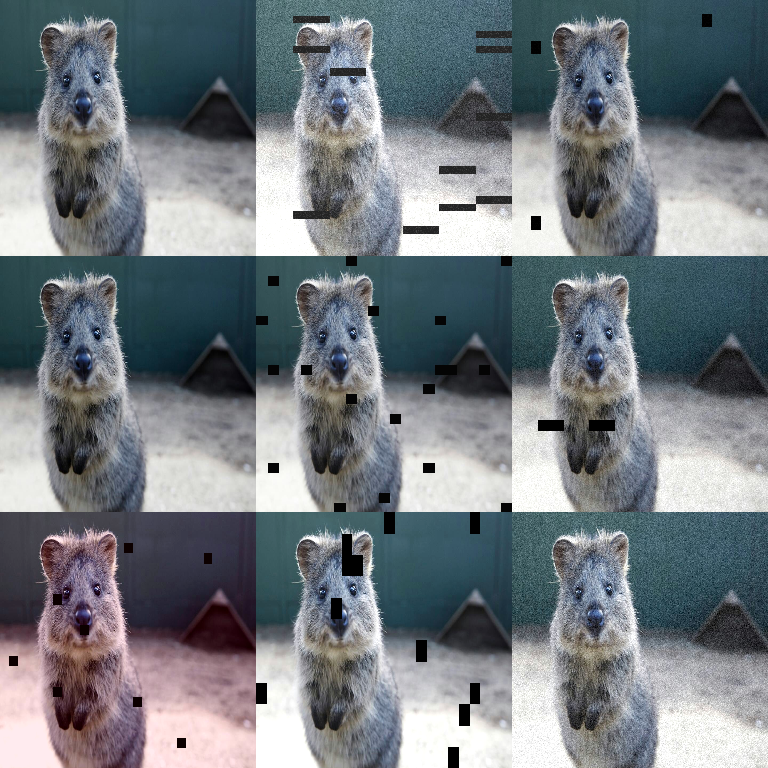

# Arithmetic Augmenters

Arithmetic augmenters apply **pixel-value operations**: brightness shifts, noise,
dropout/cutout, and compression artifacts.

They are (mostly) **photometric**: they change *values* but not *geometry*.



## When to use

- Simulate sensor noise or low-light conditions.
- Improve robustness to exposure/brightness variation.
- Add regularization via dropout/cutout-style masking.
- Simulate compression artifacts for “in the wild” images.

## Quick Start

```python
import imgaug2.augmenters as iaa

aug = iaa.SomeOf(
    (0, 3),
    [
        iaa.Add((-30, 30), per_channel=0.3),                      # brightness shift
        iaa.Multiply((0.8, 1.2), per_channel=0.3),                # brightness scale
        iaa.AdditiveGaussianNoise(scale=(0, 0.05 * 255)),         # sensor noise
        iaa.CoarseDropout((0.0, 0.05), size_percent=(0.02, 0.2)), # cutout-ish
        iaa.JpegCompression(compression=(5, 30)),                 # jpeg artifacts
    ],
    random_order=True,
)
```

## Common Augmenters (Cheat Sheet)

```python
import imgaug2.augmenters as iaa

# Brightness / intensity
iaa.Add((-40, 40), per_channel=0.3)
iaa.Multiply((0.8, 1.2), per_channel=0.3)

# Noise
iaa.AdditiveGaussianNoise(scale=(0, 0.08 * 255))
iaa.SaltAndPepper(p=(0, 0.03))

# Dropout / cutout
iaa.Dropout(p=(0.0, 0.1))
iaa.CoarseDropout((0.0, 0.05), size_percent=(0.02, 0.2))
iaa.Cutout(fill_mode="constant", cval=(0, 255))

# Inversions / threshold-like effects
iaa.Invert(0.5)
iaa.Solarize(0.2, threshold=(64, 192))

# Artifacts
iaa.JpegCompression(compression=(5, 30))
```

## Key Parameters & Pitfalls

### `per_channel` is often the difference between “useful” and “weird”

Many arithmetic augmenters support `per_channel`:

- `per_channel=False`: one sampled value is applied to all channels.
- `per_channel=True`: sample one value per channel (stronger color jitter).
- `per_channel=0.3`: enable per-channel behavior for ~30% of images.

For natural images, `per_channel=0.1` to `0.3` is often enough.

### Noise scaling: think in “pixel units”

Most imgaug-style noise configs assume `uint8` images in `[0, 255]`.

- `scale=(0, 0.05 * 255)` corresponds to roughly “up to 5% of the full range”.
- If you use `float32` images in `[0.0, 1.0]`, your noise scales should be much smaller.

### Dropout vs CoarseDropout vs Cutout

- `Dropout` drops individual pixels (salt-like).
- `CoarseDropout` drops **blocks** (closer to Cutout).
- `Cutout` is explicit about how dropped pixels are filled (constant, per-channel, etc.).

## Annotation Behavior

Arithmetic augmenters are **image-only**. When you pass annotations (keypoints,
bbs, polygons, segmaps, heatmaps) into the same augmentation call, they will be:

- kept perfectly in sync with any geometric transforms in your pipeline,
- and left unchanged by arithmetic-only operations (as expected).

See: [All Augmentables Together](../examples/all_augmentables.md).

## Performance Notes

- Most arithmetic augmenters are fast and vectorized.
- `JpegCompression` is comparatively expensive (it round-trips through JPEG).
- If performance matters, prefer combining multiple light augmenters inside a
  `SomeOf(...)` rather than running everything for every sample.

## All Augmenters

`Add`, `AddElementwise`, `AdditiveGaussianNoise`, `AdditiveLaplaceNoise`,
`AdditivePoissonNoise`, `Multiply`, `MultiplyElementwise`, `Cutout`, `Dropout`,
`CoarseDropout`, `Dropout2d`, `TotalDropout`, `SaltAndPepper`, `Salt`, `Pepper`,
`Invert`, `Solarize`, `JpegCompression`
