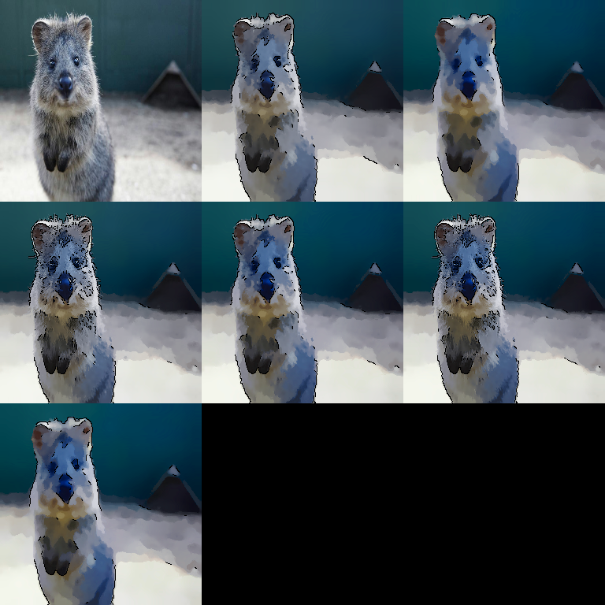

# Artistic Augmenters

Artistic effects create stylized images. These are usually not “realistic”
augmentations, but can be useful for robustness experiments or as a strong
regularizer in some settings.



## Usage

```python
import imgaug2.augmenters as iaa

iaa.Cartoon()  # Cartoon effect
```

## Cartoon

`Cartoon` creates a cartoon-like appearance by combining:

- median blurring
- segmentation-like smoothing
- edge detection + blending

It was originally tuned for mid-sized images (roughly 200–800px). Very small or
very large images may look odd.

### Example configuration

```python
import imgaug2.augmenters as iaa

aug = iaa.Cartoon(
    blur_ksize=(1, 5),
    segmentation_size=(0.8, 1.2),
    saturation=(1.5, 2.5),
    edge_prevalence=(0.9, 1.1),
)
```

## Notes / Gotchas

- This is image-only; annotations are not modified.
- `Cartoon` is comparatively expensive. Prefer `Sometimes(...)` if you include it in a training pipeline.
- Works best on `uint8` RGB images.

## All Augmenters

`Cartoon`
