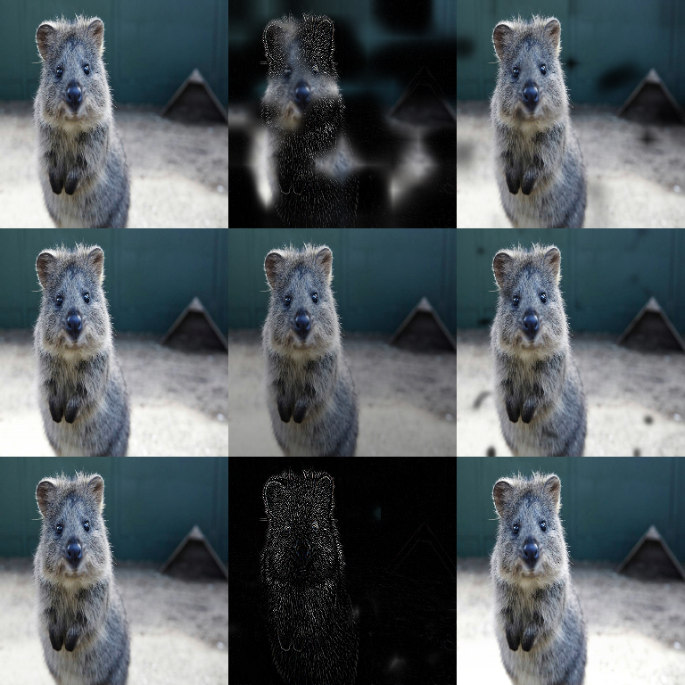

# Blend Augmenters

Augmenters that blend/overlay effects onto images.



!!! note "Compatibility"
    `imgaug2.augmenters.overlay` is a deprecated alias for `imgaug2.augmenters.blend`.
    If you see `Alpha`, `AlphaElementwise`, etc. in older code, they map to the
    `BlendAlpha*` classes in this module.

## Key Concepts

### Foreground / background

Most blend augmenters conceptually compute:

- `foreground = foreground_aug(image)`
- `background = background_aug(image)` (or the original if `background=None`)
- `output = alpha * foreground + (1 - alpha) * background`

This is powerful because you can apply **strong effects locally** while keeping
the rest of the image close to the original.

### Alpha mask generation

Different `BlendAlpha*` classes differ mainly in how they generate `alpha`:

- constant factor (`BlendAlpha`)
- noise masks (`BlendAlphaSimplexNoise`, `BlendAlphaFrequencyNoise`)
- structured masks (checkerboards/grids/gradients)
- masks from data (segmentation maps / bounding boxes)

## BlendAlpha

Blend augmented and original images using alpha.

```python
import imgaug2.augmenters as iaa

# Blend blur effect with original
aug = iaa.BlendAlpha(
    factor=(0.0, 1.0),
    foreground=iaa.GaussianBlur(sigma=2.0)
)
```

## Recipe: Localized Blur

```python
import imgaug2.augmenters as iaa

aug = iaa.BlendAlphaSimplexNoise(
    foreground=iaa.GaussianBlur(sigma=(1.0, 3.0)),
    per_channel=False,
)
```

## BlendAlphaMask

Blend using a mask pattern.

```python
import imgaug2.augmenters as iaa

aug = iaa.BlendAlphaMask(
    mask_generator=iaa.SomeColorsMaskGen(),
    foreground=iaa.AdditiveGaussianNoise(scale=0.1*255)
)
```

## BlendAlphaSegMapClassIds / BlendAlphaBoundingBoxes

These variants use **your annotations as masks** to apply effects only in
specific regions:

- `BlendAlphaSegMapClassIds`: apply foreground only on specific segmentation classes
- `BlendAlphaBoundingBoxes`: apply foreground only inside bounding boxes

These are especially useful for domain randomization (“change only the object”).

## BlendAlphaSimplexNoise

Blend using simplex noise pattern.

```python
import imgaug2.augmenters as iaa

aug = iaa.BlendAlphaSimplexNoise(
    foreground=iaa.EdgeDetect(1.0)
)
```

## BlendAlphaFrequencyNoise

Blend using frequency-based noise.

```python
import imgaug2.augmenters as iaa

aug = iaa.BlendAlphaFrequencyNoise(
    foreground=iaa.Multiply((0.5, 1.5))
)
```

## BlendAlphaSomeColors

Blend affecting only certain colors.

```python
import imgaug2.augmenters as iaa

aug = iaa.BlendAlphaSomeColors(
    foreground=iaa.Grayscale(1.0)
)
```

## BlendAlphaHorizontalLinearGradient

Blend with horizontal gradient.

```python
import imgaug2.augmenters as iaa

aug = iaa.BlendAlphaHorizontalLinearGradient(
    foreground=iaa.Add(100)
)
```

## BlendAlphaVerticalLinearGradient

Blend with vertical gradient.

```python
import imgaug2.augmenters as iaa

aug = iaa.BlendAlphaVerticalLinearGradient(
    foreground=iaa.Multiply(0.5)
)
```

## BlendAlphaRegularGrid

Blend with regular grid pattern.

```python
import imgaug2.augmenters as iaa

aug = iaa.BlendAlphaRegularGrid(
    nb_rows=4,
    nb_cols=4,
    foreground=iaa.Multiply((0.0, 0.5))
)
```

## BlendAlphaCheckerboard

Blend with checkerboard pattern.

```python
import imgaug2.augmenters as iaa

aug = iaa.BlendAlphaCheckerboard(
    nb_rows=8,
    nb_cols=8,
    foreground=iaa.AddToHueAndSaturation((-50, 50))
)
```

## Annotation Behavior

Most blend augmenters are **image-only**. Your geometric annotations (bbs/kps/polys/lines)
are not modified by blending.

The exceptions are “mask from annotation” variants (segmaps/bbs), which *use*
the annotation to build a mask (but do not geometrically transform it by themselves).

For keeping annotations aligned with geometric transforms, pass everything into
the same augmentation call:
[All Augmentables Together](../examples/all_augmentables.md).

## Performance Notes

Blending can be more expensive than a single op because it may run:

- the `foreground` pipeline
- the `background` pipeline (if provided)
- alpha mask generation (noise/grid/etc)

If performance matters, prefer applying blending selectively (e.g. with `Sometimes(...)`).

## All Blend Augmenters

| Augmenter | Description |
|-----------|-------------|
| `BlendAlpha` | Alpha blending |
| `BlendAlphaMask` | Mask-based blending |
| `BlendAlphaSimplexNoise` | Simplex noise blending |
| `BlendAlphaFrequencyNoise` | Frequency noise blending |
| `BlendAlphaSomeColors` | Color-based blending |
| `BlendAlphaHorizontalLinearGradient` | Horizontal gradient |
| `BlendAlphaVerticalLinearGradient` | Vertical gradient |
| `BlendAlphaRegularGrid` | Grid pattern |
| `BlendAlphaCheckerboard` | Checkerboard pattern |
| `BlendAlphaSegMapClassIds` | Segmentation mask blending |
| `BlendAlphaBoundingBoxes` | Bounding box blending |
