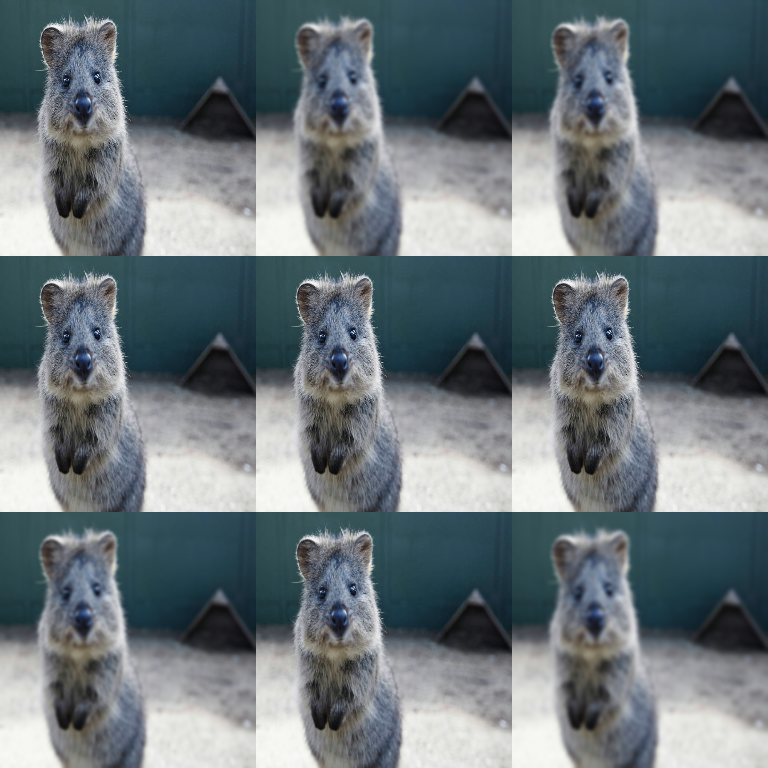

# Blur Augmenters

Blurring effects (Gaussian, box/average, median, motion, bilateral).

Blur augmenters are usually **photometric** (image-only). For annotations:

- bounding boxes / keypoints / polygons: unchanged (by design)
- heatmaps / segmentation maps: blurring often does not make semantic sense (use hooks or separate pipelines)

See: [Hooks](../hooks.md).

## Common Augmenters

```python
import imgaug2.augmenters as iaa

iaa.GaussianBlur(sigma=(0, 1.0))      # Gaussian blur
iaa.AverageBlur(k=(2, 7))             # Box blur
iaa.MedianBlur(k=(3, 7))              # Median filter
iaa.MotionBlur(k=15)                  # Motion blur
iaa.BilateralBlur(d=(3, 10))          # Edge-preserving
```



## Practical Recipes

### Apply blur rarely (typical training setup)

```python
import imgaug2.augmenters as iaa

aug = iaa.Sometimes(0.2, iaa.GaussianBlur(sigma=(0.0, 1.5)))
```

### Small vs large blur

```python
aug = iaa.OneOf(
    [
        iaa.GaussianBlur(sigma=(0.0, 0.5)),  # subtle
        iaa.GaussianBlur(sigma=(1.0, 2.5)),  # strong
    ]
)
```

## Key Parameters

### `GaussianBlur(sigma=...)`

- `sigma` controls blur strength; `sigma=0` is effectively a no-op.
- Use a range `(0.0, 1.5)` for stochastic blur.

### `AverageBlur(k=...)`, `MedianBlur(k=...)`

- `k` is the kernel size (larger = stronger blur, slower).
- Median blur can be significantly more expensive than average blur.

### `BilateralBlur(d=...)`

Edge-preserving blur. Often expensive; use sparingly.

## Performance Notes

- `GaussianBlur` is usually a good default.
- `MotionBlur` and `BilateralBlur` are typically the slowest blur augmenters.
- Blur cost scales quickly with image size and kernel size.

See: `docs/performance.md`.

## All Augmenters

`GaussianBlur`, `AverageBlur`, `MedianBlur`, `BilateralBlur`, `MotionBlur`, `MeanShiftBlur`
