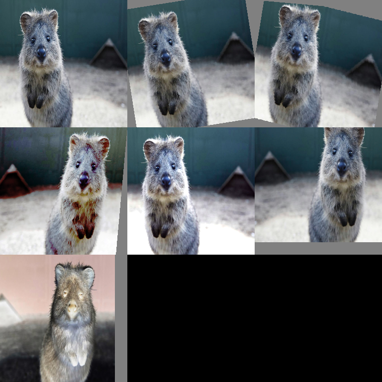

# Collections Augmenters

Pre-built augmentation collections and strategies.

## RandAugment

Implementation of RandAugment paper strategy.



```python
import imgaug2.augmenters as iaa

# Standard RandAugment
aug = iaa.RandAugment()

# Custom parameters
aug = iaa.RandAugment(
    n=2,           # Number of augmenters to apply
    m=(6, 12)      # Magnitude range (0-30)
)
```

RandAugment automatically selects and applies N augmentations from a predefined set, each with magnitude M.

## Recommended Use

RandAugment is primarily a **classification** augmentation strategy.

It includes operations like flips, crops, PIL-like affine transforms, and color ops.
For detection/segmentation pipelines (where you must keep labels aligned),
prefer explicit `Affine/Resize/CropAndPad` + mild photometric jitter, or pass
data through a pipeline that supports your annotation types.

See: [Augmenter Index](augmenter_index.md).

!!! warning
    `RandAugment` in imgaug2 is **images-only** (no bounding boxes/keypoints/polygons/segmaps).
    This matches the implementation’s design: it uses PIL-based transforms for
    output parity with the original RandAugment reference, which don’t currently
    support non-image augmentables.

## Available Operations in RandAugment

RandAugment includes these operations:
- AutoContrast
- Equalize
- Rotate
- Solarize
- Color
- Posterize
- Contrast
- Brightness
- Sharpness
- ShearX, ShearY
- TranslateX, TranslateY

## Parameters

- `n`: how many operations are sampled (per image).
- `m`: magnitude (strength), in the paper’s scale. imgaug2 uses a default range
  suited for ImageNet-style setups, but you should validate on your domain.

## Reproducibility

Use `ia.seed(...)` for repeatable runs, or explicitly seed the augmenter:

```python
import imgaug2 as ia
import imgaug2.augmenters as iaa

ia.seed(0)
aug = iaa.RandAugment(n=2, m=9)
```

## All Collections Augmenters

| Augmenter | Description |
|-----------|-------------|
| `RandAugment` | RandAugment strategy |
