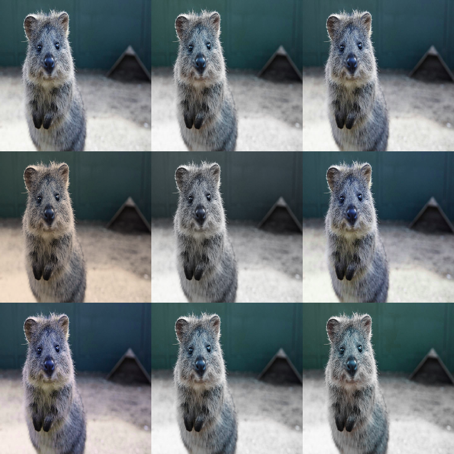

# Color Augmenters

Color augmenters modify **chromatic properties**: hue/saturation shifts,
colorspace conversions, temperature changes, and quantization/posterization.

They are photometric: they **do not move pixels**.



## Quick Start (Color Jitter)

```python
import imgaug2.augmenters as iaa

color_jitter = iaa.SomeOf(
    (0, 3),
    [
        iaa.Grayscale(alpha=(0.0, 1.0)),
        iaa.AddToHueAndSaturation((-20, 20), per_channel=0.2),
        iaa.ChangeColorTemperature((3000, 9000)),
        iaa.Posterize(nb_bits=(4, 8)),
    ],
    random_order=True,
)
```

## Common Augmenters

```python
import imgaug2.augmenters as iaa

iaa.Grayscale(alpha=(0.0, 1.0))              # mix RGB -> grayscale
iaa.AddToHueAndSaturation((-20, 20))         # hue/saturation jitter (HSV)
iaa.ChangeColorTemperature((3000, 8000))     # warm/cool shift
iaa.Posterize(nb_bits=(4, 8))                # reduce number of intensity bits
```

## Key Parameters & Pitfalls

### Hue/saturation value ranges

`AddToHueAndSaturation` uses imgaug’s historic convention: values are in roughly
`[-255, +255]`.

- Use small ranges first: `(-10, 10)` or `(-20, 20)`.
- `per_channel=True` can be strong; `per_channel=0.1..0.3` is often enough.

### dtype support varies by augmenter

Some colorspace-based augmenters are primarily tested on `uint8` (OpenCV-style
pipelines). If you train in `float32`, start with mild settings and validate
quickly on a few samples.

See: [dtype Support](../dtype_support.md).

### Colorspace assumptions (RGB vs BGR)

Most users provide images in RGB order. If your data is BGR (common in some OpenCV
pipelines), be explicit with `ChangeColorspace(...)` or convert first.

## Annotation Behavior

Color augmenters are **image-only**. Bounding boxes/keypoints/polygons/line
strings are unaffected. Heatmaps/segmaps are also kept unchanged by photometric
ops.

See: [All Augmentables Together](../examples/all_augmentables.md).

## All Augmenters

`Grayscale`, `RemoveSaturation`, `ChangeColorspace`, `AddToHueAndSaturation`,
`AddToHue`, `AddToSaturation`, `MultiplyHueAndSaturation`,
`ChangeColorTemperature`, `Posterize`, `UniformColorQuantization`,
`KMeansColorQuantization`
