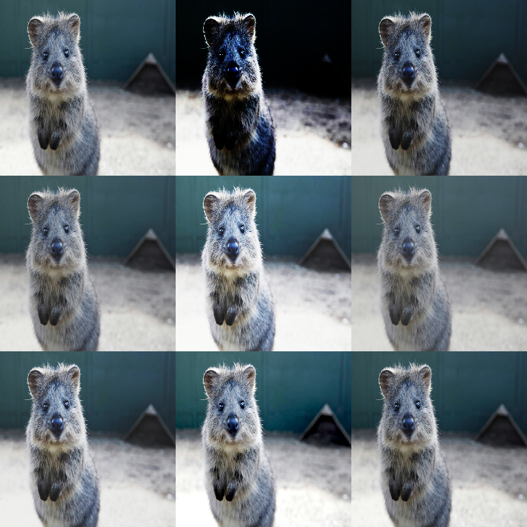

# Contrast Augmenters

Contrast augmenters change **the distribution of intensities** in an image:
linear/gamma/sigmoid/log contrast and histogram equalization (global or adaptive).



## Quick Start (Typical Contrast Jitter)

```python
import imgaug2.augmenters as iaa

aug = iaa.SomeOf(
    (0, 2),
    [
        iaa.LinearContrast((0.75, 1.25), per_channel=0.2),
        iaa.GammaContrast((0.7, 1.6), per_channel=0.2),
        iaa.SigmoidContrast(gain=(3, 10), cutoff=(0.4, 0.6)),
    ],
    random_order=True,
)
```

## Common Augmenters

```python
import imgaug2.augmenters as iaa

iaa.LinearContrast((0.75, 1.25), per_channel=0.2)
iaa.GammaContrast((0.7, 1.6), per_channel=0.2)
iaa.SigmoidContrast(gain=(3, 10), cutoff=(0.4, 0.6))
iaa.CLAHE()  # adaptive histogram equalization
```

## Key Parameters & Pitfalls

### `per_channel`

For contrast, `per_channel=True` can induce color shifts (channels are adjusted
independently). This can be useful as light “color jitter”, but can also be too
strong for some domains.

Try `per_channel=0.1..0.3` first.

### Histogram equalization is domain-sensitive

- `HistogramEqualization` and `CLAHE` can drastically change appearance.
- They are sometimes helpful for medical/industrial images, less so for natural images.

If you use them, prefer `Sometimes(...)` or `SomeOf(...)` so they don’t apply to
every sample.

## Annotation Behavior

Contrast augmenters are **image-only**. They don’t change geometry, and are
ignored for bounding boxes/keypoints/polygons/line strings/heatmaps/segmaps.

## All Augmenters

`GammaContrast`, `SigmoidContrast`, `LogContrast`, `LinearContrast`, `CLAHE`,
`AllChannelsCLAHE`, `HistogramEqualization`, `AllChannelsHistogramEqualization`
