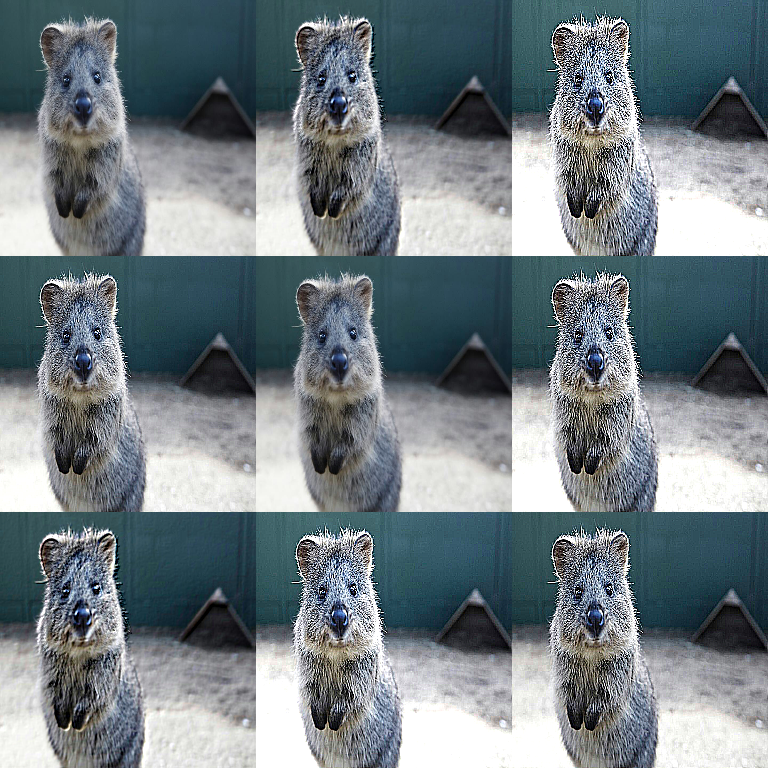

# Convolutional Augmenters

Convolutional augmenters apply **small kernels** to images. They’re useful for
sharpening, embossing, and simple edge-like effects.

These are photometric effects: they **do not move pixels**.



## Usage

```python
import imgaug2.augmenters as iaa

iaa.Sharpen(alpha=(0, 1.0))              # Sharpening
iaa.Emboss(alpha=(0, 1.0))               # Emboss
iaa.EdgeDetect(alpha=(0, 0.75))          # Edge detection
iaa.DirectedEdgeDetect(alpha=(0, 0.75))  # Directional edges
```

## Quick Start (Sharpen / Emboss)

```python
import imgaug2.augmenters as iaa

aug = iaa.OneOf(
    [
        iaa.Sharpen(alpha=(0.0, 1.0), lightness=(0.8, 1.6)),
        iaa.Emboss(alpha=(0.0, 1.0), strength=(0.0, 2.0)),
    ]
)
```

## Custom Kernels (`Convolve`)

If you want full control, use `Convolve` with an explicit kernel matrix.

```python
import numpy as np
import imgaug2.augmenters as iaa

# A simple “sharpen” kernel.
kernel = np.array(
    [[0, -1, 0],
     [-1, 5, -1],
     [0, -1, 0]],
    dtype=np.float32,
)

aug = iaa.Convolve(matrix=kernel)
```

## Key Parameters & Pitfalls

### `alpha` is the “how much of the effect”

Many convolutional augmenters use `alpha` as a blend factor:

- `alpha=0.0` → original image
- `alpha=1.0` → only the filtered image

For most datasets, start with ranges like `alpha=(0.0, 0.3)`.

### Sharpen: `lightness`

`Sharpen(..., lightness=...)` controls how bright/strong edges become.

- Values near `1.0` are usually safe.
- Very low values can look like an edge map.
- Very high values can clip highlights in `uint8`.

### Emboss: `strength`

`Emboss(..., strength=...)` controls the embossing effect magnitude.

## dtype Notes

Many convolution operations run through OpenCV filters and are best-tested on
`uint8` and `float32`. If you see dtype-related issues, convert inputs to one of
these and validate.

See: [dtype Support](../dtype_support.md).

## Annotation Behavior

Convolutional augmenters are **image-only**. They do not modify bounding boxes,
keypoints, polygons, heatmaps, segmentation maps, etc.

If you want an edge-map style overlay, also see:

- kernel-based edge effects: `EdgeDetect`, `DirectedEdgeDetect` (this module)
- Canny edge detector: [Edges augmenters](edges.md)

## All Augmenters

`Convolve`, `Sharpen`, `Emboss`, `EdgeDetect`, `DirectedEdgeDetect`
