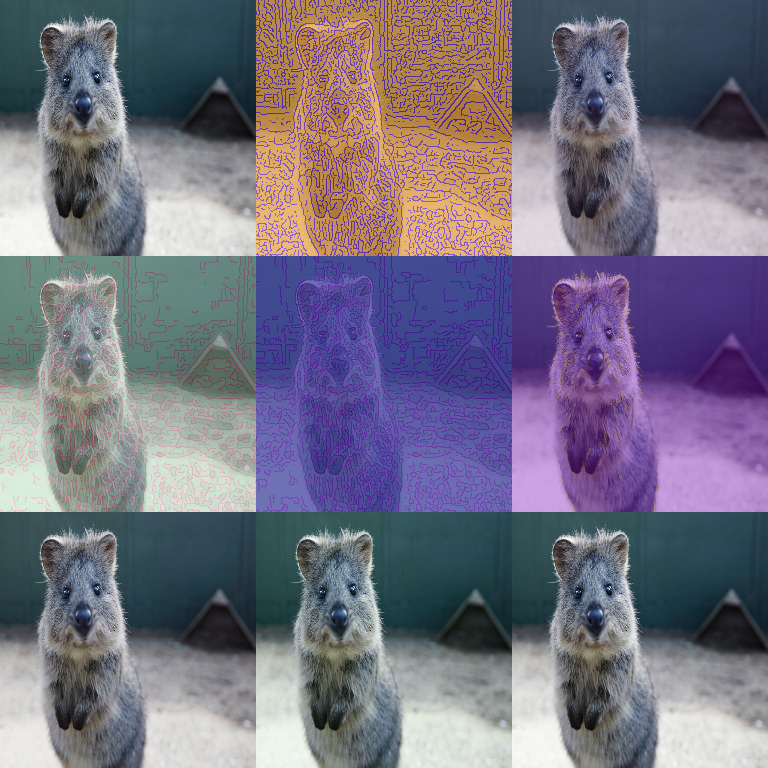

# Edges Augmenters

Augmenters for edge detection effects.

These are typically used as stylization/robustness augmentations (overlaying
edges on top of the original image), not as label transformations.



## Canny

Apply Canny edge detection.

```python
import imgaug2.augmenters as iaa

aug = iaa.Canny()
aug = iaa.Canny(
    alpha=(0.0, 0.5),
    hysteresis_thresholds=((100, 200), (200, 300)),
    sobel_kernel_size=(3, 7)
)
```

## Parameters

- `alpha`: Blending factor with original image (0=original, 1=edges only)
- `hysteresis_thresholds`: Low and high thresholds for Canny algorithm
- `sobel_kernel_size`: Kernel size for Sobel operator

## Notes / Gotchas

- Canny is sensitive to image scale and noise. If your images vary a lot in
  brightness/contrast, expect edge density to vary a lot too.
- For a kernel-based edge effect (less “binary” than Canny), see
  `EdgeDetect` and `DirectedEdgeDetect` in [Convolutional augmenters](convolutional.md).

## Annotation Behavior

`Canny` is **image-only**; it does not modify bounding boxes/keypoints/polygons,
heatmaps, segmentation maps, etc.

## Example

```python
import imgaug2.augmenters as iaa

# Subtle edge overlay
aug = iaa.Canny(alpha=(0.0, 0.3))

# Strong edge detection
aug = iaa.Canny(alpha=(0.5, 1.0))
```

## All Edge Augmenters

| Augmenter | Description |
|-----------|-------------|
| `Canny` | Canny edge detection |
