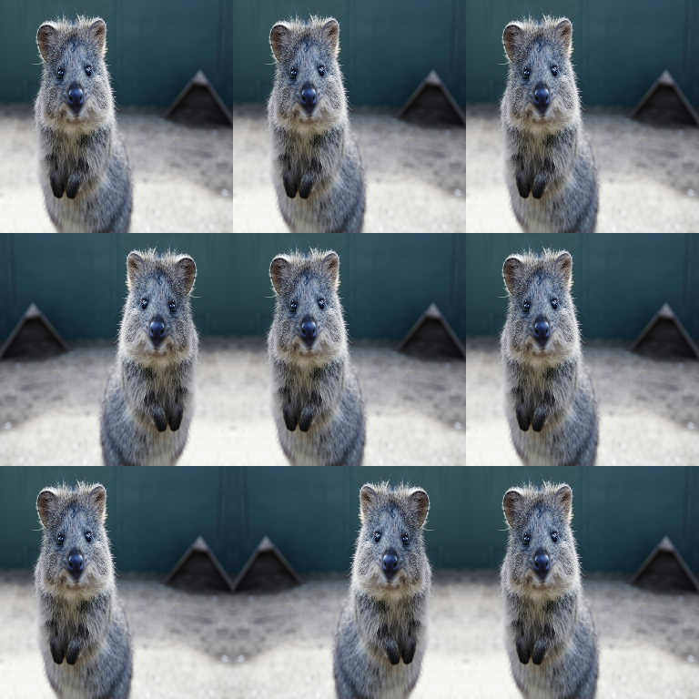

# Flip Augmenters

Flip augmenters mirror images and all geometric annotations.

They are usually the **cheapest** geometric augmentation you can add.



## Usage

```python
import imgaug2.augmenters as iaa

iaa.Fliplr(0.5)   # Horizontal flip, 50% chance
iaa.Flipud(0.5)   # Vertical flip, 50% chance
```

## Augmenting with Annotations

Flips automatically apply to:

- bounding boxes
- keypoints
- polygons and line strings
- heatmaps and segmentation maps

Recommended pattern:

```python
import imgaug2 as ia
import imgaug2.augmenters as iaa
import imgaug2.data as data

image = data.quokka(size=(256, 256))
bbs = data.quokka_bounding_boxes(size=(256, 256))

aug = iaa.Fliplr(1.0)  # always flip for demo
image_aug, bbs_aug = aug(image=image, bounding_boxes=bbs)

# visualize
vis = bbs_aug.draw_on_image(image_aug, size=2)
ia.imshow(vis)
```

## Pitfalls (Label Semantics)

For tasks with **left/right semantics** (e.g. pose estimation keypoints: “left eye”),
a flip changes the meaning of labels.

- imgaug2 flips the coordinates correctly.
- Your training pipeline may also need to swap labels (e.g. left↔right keypoints).

## All Augmenters

`Fliplr`, `Flipud`, `HorizontalFlip`, `VerticalFlip`
