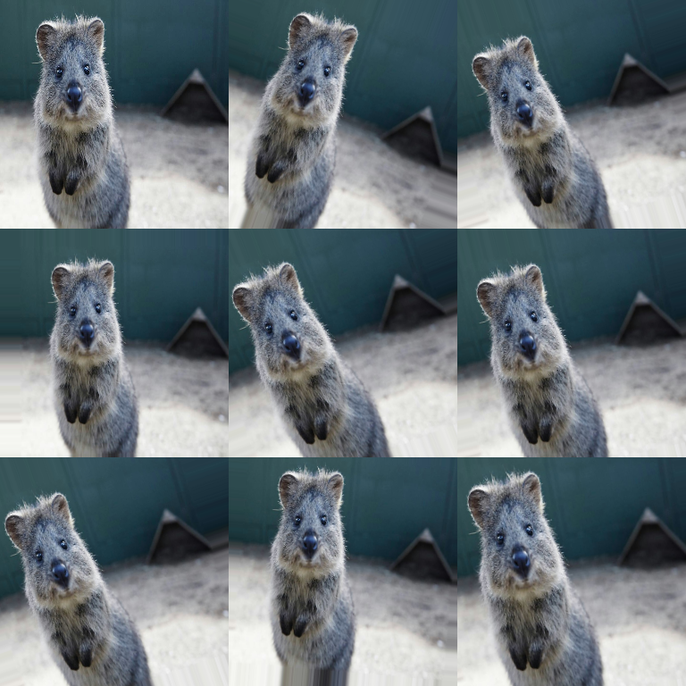

# Geometric Augmenters

Spatial transformations (affine warps, perspective transforms, elastic deformation, etc.).

These augmenters are the ones that most often need:

- **interpolation choices** (`order`)
- **border handling** (`mode`, `cval`)
- careful handling of **annotations** (bbs/kps/polys/segmaps/heatmaps)

## Quick Start

```python
import imgaug2.augmenters as iaa

aug = iaa.Sequential(
    [
        iaa.Fliplr(0.5),
        iaa.Affine(
            rotate=(-20, 20),
            scale=(0.9, 1.1),
            translate_percent={"x": (-0.05, 0.05), "y": (-0.05, 0.05)},
            mode="edge",
        ),
    ]
)
```



## Common Augmenters

```python
import imgaug2.augmenters as iaa

iaa.Affine(rotate=(-25, 25), scale=(0.8, 1.2))  # Affine transform
iaa.Rotate((-45, 45))                            # Rotation
iaa.Rot90(k=(0, 3))                              # 90° rotations
iaa.PiecewiseAffine(scale=(0.01, 0.05))          # Local warping
iaa.PerspectiveTransform(scale=(0.01, 0.15))     # Perspective
iaa.ElasticTransformation(alpha=50, sigma=5)     # Elastic deform
```

## Key Parameters (the important ones)

### Interpolation: `order`

Many geometric operations create output pixels by sampling from the input.
`order` controls interpolation quality and speed (higher is slower).

Common values:

- `order=0`: nearest neighbor (fast; best for segmentation maps)
- `order=1`: bilinear (good default for images)
- `order=3`: cubic (slower; sometimes sharper)

### Border handling: `mode` and `cval`

When you rotate/translate/warp you create “new” pixels that must be filled.

Common modes:

- `mode="constant"`: fill with a constant `cval` (often black)
- `mode="edge"`: replicate border pixels
- `mode="reflect"` / `mode="symmetric"`: reflect at borders
- `mode="wrap"`: wrap around

Example:

```python
aug = iaa.Affine(rotate=(-25, 25), mode="constant", cval=128)
```

## Keeping Annotations Aligned

Best practice: pass images and annotations in one call so they share the same
sampled transform.

```python
image_aug, segmap_aug = aug(image=image, segmentation_maps=segmap)
```

See: [Reproducibility & Determinism](../reproducibility.md).

## Performance Notes

Rough guidance:

- **Fast**: `Fliplr`, `Flipud`, `Rot90`
- **Moderate**: `Affine`, `Rotate` (depends heavily on `order`, image size)
- **Slow**: `ElasticTransformation`, `PiecewiseAffine`, `PerspectiveTransform`

Tips:

- Use smaller images or apply heavy geometry less often (`Sometimes`).
- Prefer `order=0` where you can (labels) and `order=1` for images.

## All Augmenters

`Affine`, `AffineCv2`, `Rotate`, `Rot90`, `ShearX`, `ShearY`, `ScaleX`, `ScaleY`, `TranslateX`, `TranslateY`, `PiecewiseAffine`, `PerspectiveTransform`, `ElasticTransformation`, `WithPolarWarping`, `Jigsaw`
