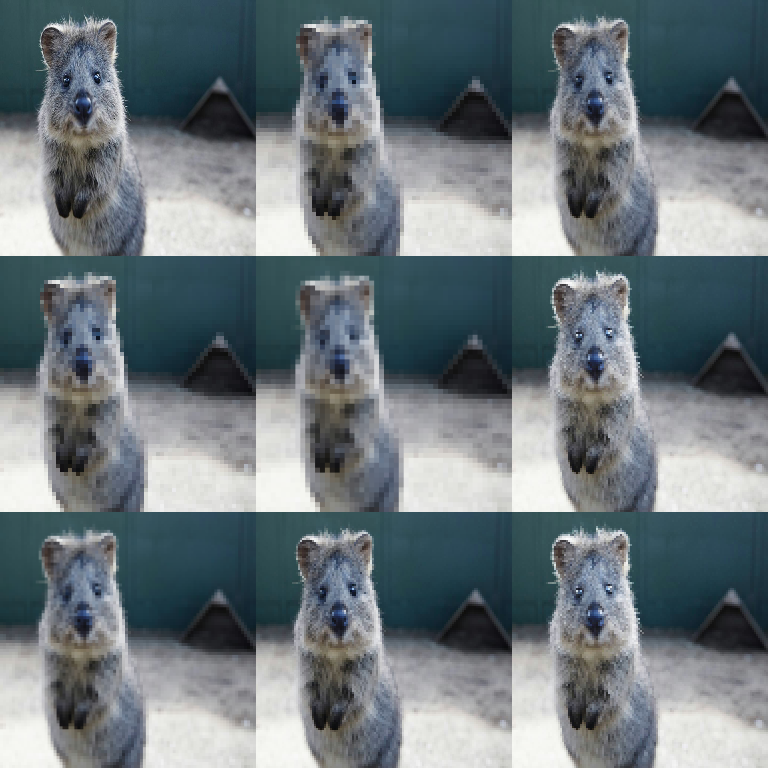

# Pooling Augmenters

Augmenters that apply pooling operations.

Pooling reduces local detail by aggregating pixels in windows. With `keep_size=True`,
it behaves like a “pixelation / blocky” effect (downsample + upsample).



## AveragePooling

Apply average pooling (box blur effect).

```python
import imgaug2.augmenters as iaa

aug = iaa.AveragePooling(kernel_size=(1, 5))
aug = iaa.AveragePooling(kernel_size=3, keep_size=True)
```

## MaxPooling

Apply max pooling.

```python
import imgaug2.augmenters as iaa

aug = iaa.MaxPooling(kernel_size=(1, 5))
aug = iaa.MaxPooling(kernel_size=2, keep_size=True)
```

## MinPooling

Apply min pooling.

```python
import imgaug2.augmenters as iaa

aug = iaa.MinPooling(kernel_size=(1, 5))
```

## MedianPooling

Apply median pooling.

```python
import imgaug2.augmenters as iaa

aug = iaa.MedianPooling(kernel_size=(1, 5))
```

## Parameters

- `kernel_size`: Size of pooling kernel (can be tuple for random)
- `keep_size`: If True (default), resize back to original size after pooling

## Notes / Gotchas

### `keep_size=True` vs `keep_size=False`

- `keep_size=True`: image output size stays fixed (most ML models want this).
  This is usually used as a *photometric* degradation effect.
- `keep_size=False`: output becomes smaller, and geometric annotations (bbs/kps/polys/lines)
  will be scaled to match the new image size. Use this only if your pipeline
  expects variable-sized samples.

### AveragePooling vs AverageBlur

- `AverageBlur` averages pixels *without stride* (classic box blur).
- `AveragePooling` averages pixels *with stride* and optionally upsamples back,
  producing a blocky/pixelated look.

## Example

```python
import imgaug2.augmenters as iaa

# Random pooling type
aug = iaa.OneOf([
    iaa.AveragePooling(kernel_size=(2, 5)),
    iaa.MaxPooling(kernel_size=(2, 5)),
    iaa.MedianPooling(kernel_size=(2, 5)),
])
```

## All Pooling Augmenters

| Augmenter | Description |
|-----------|-------------|
| `AveragePooling` | Average (mean) pooling |
| `MaxPooling` | Maximum pooling |
| `MinPooling` | Minimum pooling |
| `MedianPooling` | Median pooling |
