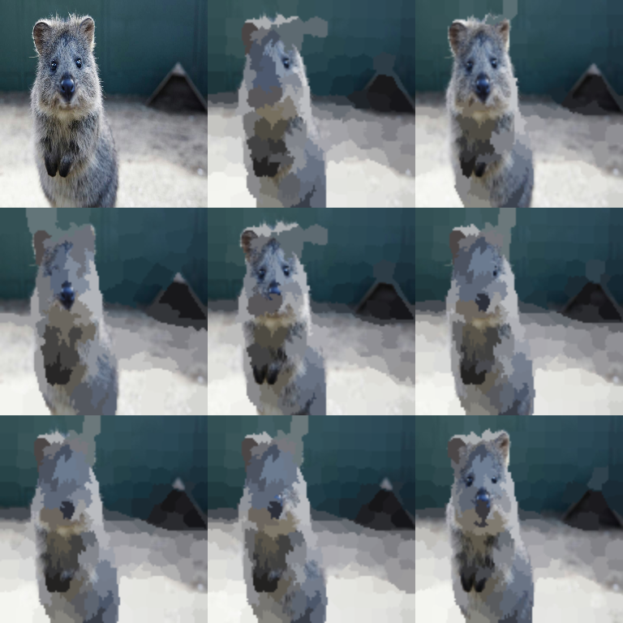

# Segmentation Augmenters

These augmenters create **segmentation-like visual effects** (superpixels and
Voronoi-style partitioning). They are image-only, and are sometimes useful for
regularization or to simulate low-quality segment boundaries.



## Usage

```python
import imgaug2.augmenters as iaa

iaa.Superpixels(p_replace=0.5, n_segments=100)  # Superpixels
iaa.UniformVoronoi(n_points=(50, 500))          # Voronoi
iaa.RegularGridVoronoi(n_rows=10, n_cols=10)    # Grid Voronoi
```

## Notes

- These augmenters are unrelated to *segmentation maps* (label images).
  For label augmentation, pass your segmentation maps into the same call as your
  images: [Segmentation Maps examples](../examples/segmentation_maps.md).

## All Augmenters

`Superpixels`, `Voronoi`, `UniformVoronoi`, `RegularGridVoronoi`, `RelativeRegularGridVoronoi`
