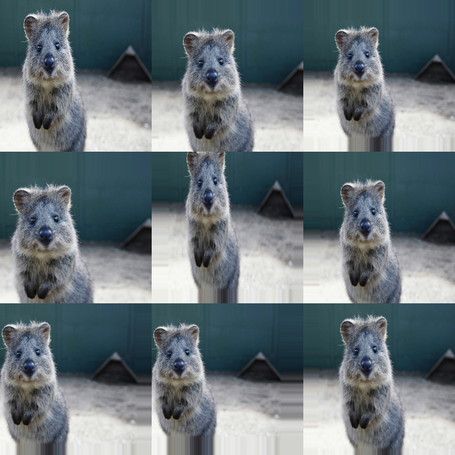

# Size Augmenters

Resize, crop, and pad operations.



## Common Augmenters

```python
import imgaug2.augmenters as iaa

iaa.Resize({"height": 128, "width": 128})  # Resize
iaa.CropAndPad(px=(-10, 10))               # Crop/pad
iaa.Crop(px=(0, 16))                       # Crop only
iaa.Pad(px=(0, 16))                        # Pad only
iaa.PadToFixedSize(width=256, height=256)  # Pad to size
iaa.CropToFixedSize(width=256, height=256) # Crop to size
```

## Recommended Patterns

### 1) Random scale (preserve aspect ratio)

```python
import imgaug2.augmenters as iaa

aug = iaa.Resize((0.5, 1.2))
```

### 2) Resize one side, keep aspect ratio

```python
import imgaug2.augmenters as iaa

aug = iaa.Resize({"height": 256, "width": "keep-aspect-ratio"})
```

### 3) Crop/pad but keep original size

`CropAndPad` defaults to `keep_size=True`, meaning it crops/pads and then resizes
back to the original image size (so your model still sees a fixed input size):

```python
import imgaug2.augmenters as iaa

aug = iaa.CropAndPad(px=(-32, 32), pad_mode="edge")  # keep_size=True by default
```

If you want the output size to actually change, set `keep_size=False`.

`KeepSizeByResize(...)` is useful when you intentionally use a size-changing
augmenter (e.g. random crops) but still must return to the original shape.

## Key Parameters & Pitfalls

### `interpolation` matters

- For images: `linear`/`cubic` are common.
- For segmentation maps: nearest-neighbor is required to preserve labels
  (imgaug2 handles this for common geometric ops).

If you want explicit control, prefer `Resize(interpolation=...)` and keep it
consistent across experiments.

### Crops can invalidate boxes/keypoints

After strong crops, some boxes/keypoints may end up out-of-image. Typical cleanup:

```python
# bbs_aug = bbs_aug.clip_out_of_image_()
# bbs_aug = bbs_aug.remove_out_of_image_()
```

## All Augmenters

`Resize`, `CropAndPad`, `Crop`, `Pad`, `PadToFixedSize`, `CropToFixedSize`, `CenterCropToFixedSize`, `CropToMultiplesOf`, `PadToMultiplesOf`, `KeepSizeByResize`
