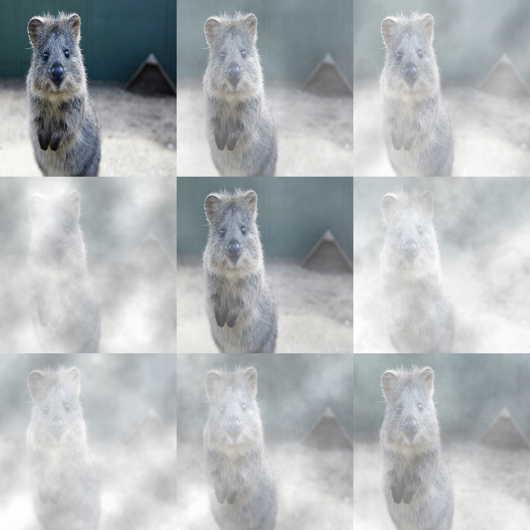

# Weather Augmenters

Weather augmenters add synthetic atmospheric effects (clouds/fog/snow/rain).

These can be useful for robustness testing, but they are domain-sensitive.



## Usage

```python
import imgaug2.augmenters as iaa

iaa.Clouds()                 # Cloud overlay
iaa.Fog()                    # Fog effect
iaa.Snowflakes()             # Snowflakes
iaa.Rain()                   # Rain effect
iaa.FastSnowyLandscape()     # Snowy scene
```

## Tips

- Use `Sometimes(...)` or `SomeOf(...)` so that not every image becomes “weathered”.
- Prefer mild configs first (fog/rain can easily overpower the image).
- These augmenters are photometric overlays; annotations (bbs/keypoints/segmaps)
  are unchanged.

## All Augmenters

`Clouds`, `Fog`, `CloudLayer`, `Snowflakes`, `SnowflakesLayer`, `Rain`, `RainLayer`, `FastSnowyLandscape`
